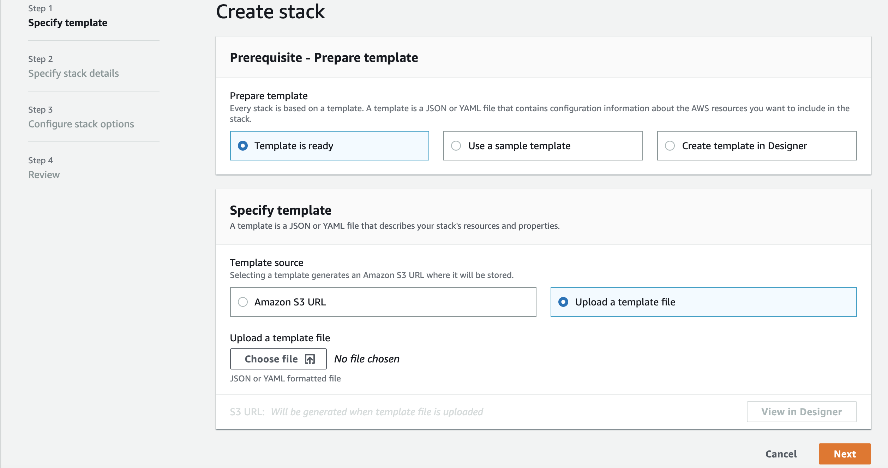
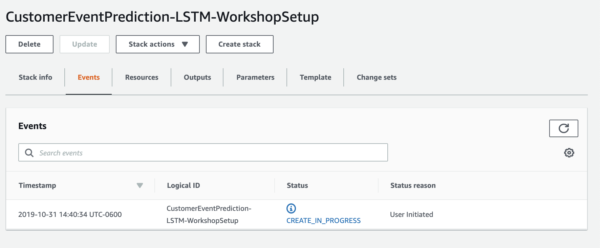

# Deploying and managing ML models at scale with Amazon SageMaker

In this workshop, we deep dive into Amazon SageMaker advanced “Deploy” capabilities such as model deployment, model management, model monitoring for drift detection.  

Consider a media company that intends to provide recommendations to their customers  based on customer purchase/viewing/listening patterns using one/more machine learning models.  
The company has a small, very talented data engineering and data scientist teams that leverage cloud capabilities to train machine learning models that provide excellent recommendations. 
Now the company wants to undertake two goals.

1.	Address the challenge of deploying trained ML models at scale, monitor the model and as necessary replace with newer/better models to keep delivering high quality recommendations to their customers.  
2.	Allow for expansion of category of recommendations.  For example, once they can effective provide movie recommendations, they want to extend to providing music recommendations and eventually to book recommendations etc. 

# High Level Steps

This workshop is divided into three modules.

   Optional : If you are provided with a temporary account by your AWS team for the workshop, follow this optional section, before starting Module 1.

   Login to AWS Console (https://dashboard.eventengine.run) using the details provided
    
   
        
   Enter hash provided. Click "Accept Terms & Login"
        
    
        
   Click "AWS Console" 
        
    
        
   Select AWS Console
        
   You should be in the AWS Console
        
    

* Module 1 : Workshop Preparation
    
    In this module you will create a few resources in your AWS account that are used in the next two modules.  These resources are created in the preparation module, so the rest of the workshop can focus on exploring advanced deployment options on Amazon SageMaker. 

    
 
    
 Click to expand for detailed preparation steps 

    1.1. Download this git repository by either cloning the repository or downloading the *zip

    1.2. Login to the [AWS Console](https://https://console.aws.amazon.com/) and enter your credentials

    1.3. Under **Services**, select search for and select [CloudFormation](https://console.aws.amazon.com/cloudformation)

    1.4. Click **Create Stack** buttton

   
   
    1.5. Under **Select Template**:
    * Click radio button next to 'Upload a template to Amazon S3', then click **Browse**
    * From the local repository cloned to your machine in the detailed step 1, select the file ./prep/Workshop-Prep.yml
    * Click **Open**
    
    
    1.6. Under **Specify Stack Details**, enter: 

    * **Stack Name**: Enter SageMakerDeploymentOptions
    *  **UniqueID**: Enter *yourinitials* in lower case (Example: jdd)

    

    1.7. Click **Next**

    1.8. Under **Options**, leave all defaults and click '**Next**'

    1.9. Under **Review**, scroll to the bottom and check the checkbox acknowledging that CloudFormation might create IAM resources and custom names, then click **Create**

    

    1.10. You will be returned to the CloudFormation console and will see your stack status '**CREATE_IN_PROGRESS**'

    

    1.11. After a few minutes, you will see your stack Status change to '**CREATE_COMPLETE**'.  You're encouraged to go explore the resources created as part of this initial setup. 

    1.12 Validate the resources created

    a. Navigate to Amazon SNS console.  You should see a SNS Topic created.
    
    b. Navigate to Lambda console.  You should see a Lambda function created.
    
    c. Navigate to Amazon SageMaker console. You should see a SageMaker Notebook Instance with name "DeploymentOptions-Notebook-reinvent" and status "InService"
        * Click “Open Jupyter”
        * Verify you see models and data directories as below
            
        
    d. Navigate to Amazon SageMaker console
   
     * Verify that the SageMaker Notebook instance “DeploymentOptions-Notebook-reinvent” is InService.
     * Click “Open Jupyter”
     * Verify you see models and data directories
   
    
   
    
* Module 2 :  Explore Amazon SageMaker Data Capture and Model Monitoring Capabilities

    In this module of the workshop, you will execute various sections of the notebook 
model-monitoring/ monitor_xgboost_recommendation_model.ipynb.

    1. Click on model-monitoring/monitor_xgboost_recommendation_model.ipynb to open it.
    2. Read through the instructions in the notebook and execute cells in the sections below in this order. 
       *  Section I - Setup
       *  Section II - Deploy pre-trained model with model data capture enabled
       *  Section III - Run predictions and analyze data captured
       *  Section IV – Generate baseline statistics and constraints
       *  Section V – Monitor and analyze model for data drift 
       *  Section VI – Retrigger movie recommendation model training 

* Module 3 : Explore Multi Model Endpoints
    In this module of the workshop, you will execute the cells in
multi-model-endpoint/multiple_recommendation_models_endpoint.ipynb. 
    1. Click on multi-model-endpoint/multiple_recommendation_models_endpoint.ipynb to open it.
    2. Read through the instructions in the notebook and execute cells. 
