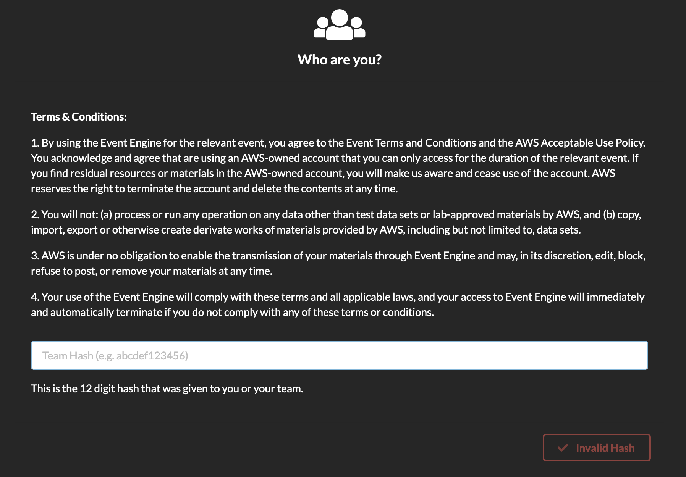
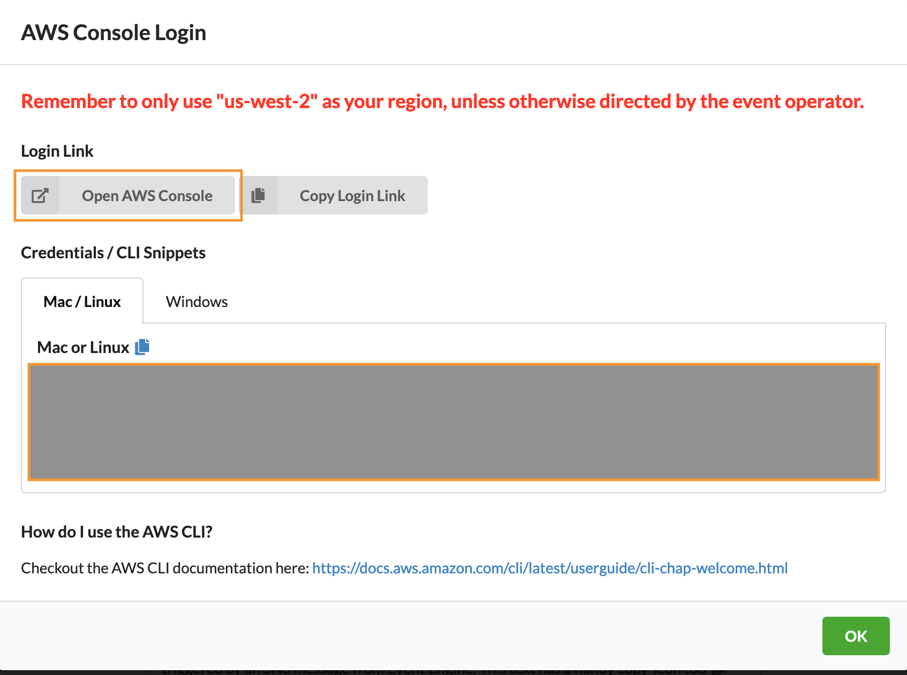

# amazon-sagemaker-multi-model-endpoints-model-monitoring

In this workshop, we deep dive into Amazon SageMaker advanced “Deploy” capabilities such as model deployment, model management, model monitoring for drift detection.  

Consider a media company that intends to provide recommendations to their customers  based on customer purchase/viewing/listening patterns using one/more machine learning models.  
The company has a small, very talented data engineering and data scientist teams that leverage cloud capabilities to train machine learning models that provide excellent recommendations. 
Now the company wants to undertake two goals.

1.	Address the challenge of deploying trained ML models at scale, monitor the model and as necessary replace with newer/better models to keep delivering high quality recommendations to their customers.  
2.	Allow for expansion of category of recommendations.  For example, once they can effective provide movie recommendations, they want to extend to providing music recommendations and eventually to book recommendations etc. 

# High Level Steps

This workshop is divided into three modules.

### Module 1 : Validate AWS account 
   1. Login to AWS Console using the details provided
    
      
        
      Enter hash provided. Click "Accept Terms & Login"
        
         
        
      Click "AWS Console" 
        
         
        
       Select AWS Console
        
      You should be in the AWS Console
        
         
        
   2. Navigate to CloudFormation console.  You should see a CloudFormation stack in "CREATE_COMPLETE" status.
    
   3. Navigate to Amazon SNS console.  You should see a SNS Topic created.
    
   4. Navigate to Lambda console.  You should see a Lambda function created.
    
   5. Navigate to Amazon SageMaker console. You should see a SageMaker Notebook Instance with name "DeploymentOptions-Notebook-reinvent" and status "InService"
        * Click “Open Jupyter”
        * Verify you see models and data directories as below
        
        
        
   6. These resources are pre created so that the workshop can focus on explore SageMaker deployment and monitoring capabilities.   
    
### Module 2 : Explore Amazon SageMaker Data Capture and Model Monitoring Capabilities

   In this module of the workshop, you will execute various sections of the notebook "model-monitoring/monitor_xgboost_recommendation_model.ipynb"

   1. From the SageMaker notebook instance above, Click on model-monitoring/monitor_xgboost_recommendation_model.ipynb to open it.
   2. Read through the instructions in the notebook and execute cells in the sections below in this order. 
       *  Section 1 - Setup
       *  Section 2 - Deploy pre-trained model with model data capture enabled
       *  Section 3 - Run predictions and analyze data captured
       *  Section 4 – Generate baseline statistics and constraints
       *  Section 5 – Monitor and analyze model for data drift 
       *  Section 6 – Retrigger movie recommendation model training 

### Module 3 : Explore Multi Model Endpoints

   In this module of the workshop, you will execute the cells in "multi-model-endpoint/multiple_recommendation_models_endpoint.ipynb" 
   1. Click on multi-model-endpoint/multiple_recommendation_models_endpoint.ipynb to open it.
   2. Read through the instructions in the notebook and execute cells. 
